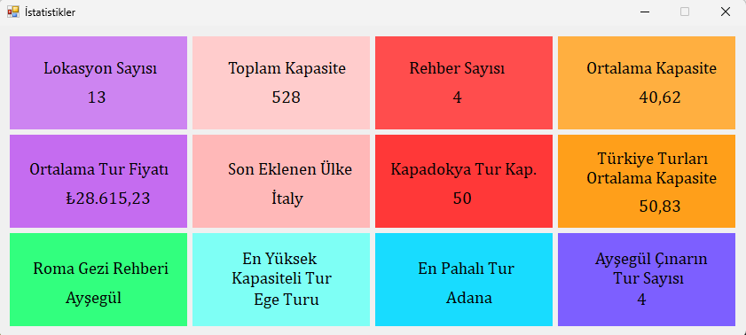

# 🚀 C# EĞİTİM KAMPI PROJELERİ

Bu repo, Murat Yücedağ'ın eğitmenliğinde tamamladığım C# Eğitim Kampı boyunca geliştirdiğim ilk 9 projeyi içermektedir. Her bir proje, programlama becerilerimi geliştirmeme katkıda bulundu. Aşağıda projelere dair teknik ayrıntıları bulabilirsiniz:

## 🌟 Proje 1: Merhaba Dünya!(MainSubjects)
Konsola metin yazdırmayı öğrendim. **Console.WriteLine()** komutunu kullanarak basit yazdırma işlemlerini gerçekleştirdim ve temel C# program yapısını anlamaya başladım. 💻

## 🌟 Proje 2: Değişkenler(Variables)
**int**, **string**, **double** gibi farklı veri türlerinde değişkenler tanımlamayı ve bu değişkenler üzerinde işlem yapmayı deneyimledim. Veri türlerinin mantığını kavramaya çalıştım. 🔠

## 🌟 Proje 3: Karar Yapıları (MakingDecision)
**If-else** yapılarıyla farklı koşullar altında nasıl karar verileceğini uyguladım. Programın koşullara göre nasıl tepki vereceğini gözlemleyerek karar yapılarının işlevini öğrendim. 🎯

## 🌟 Proje 4: Döngüler (Loops)
**for** ve **while** döngülerini kullanarak tekrar eden işlemleri otomatikleştirdim. Büyük veri setlerini döngüler yardımıyla işleyerek döngülerin gücünü keşfettim. 🔁

## 🌟 Proje 5: Döngüler İle Yıldız Oluşturma (LoopsWithStars)
**for** döngüsü kullanarak -Dik Üçgen, -Ters Dik Üçgen, -Yarım Elmas, -Piramit, -Ters Piramit, ve -Elmas şekli yapmayı öğrendim. 🔁

## 🌟 Proje 6: Diziler (Arrays)
Birden fazla değeri tek bir dizi içerisinde saklamayı ve döngülerle bu değerlere erişmeyi öğrendim. Böylece daha organize bir veri yapısına sahip olmayı keşfettim. 🧮

## 🌟 Proje 7: Foreach Döngüsü(Foreach)
**foreach** döngüsü ile bir sınav simülasyonu oluşturdum. Öğrencilerin sınav notlarını alarak ortalamalarını hesapladım ve sonuçlarına göre başarı durumlarını belirledim. 🎓

## 🌟 Proje 8: Metotlar (Methods)
Kodlarımı daha modüler hale getirmek için metotlar oluşturdum. Parametre alan ve sonuç döndüren metotlarla çalışarak kodun okunabilirliğini ve tekrar kullanılabilirliğini artırdım. 🛠️

## 🌟 Proje 9: SQL Bağlantısı ve ADO.NET
**ADO.NET** aracılığıyla SQL veritabanına bağlanmayı öğrendim. Veritabanındaki tablo verilerini listeleyip SQL sorguları ile veri çekme işlemlerini gerçekleştirdim. 💽

## 🌟 Proje 10: CRUD İşlemleri
**CRUD** işlemlerini sırasıyla tamamladım. (**C** - Create) Insert ile veri kaydettik, (**R** - Read) Write ile veri listeledik, (**U** - Update) Update ile veritabanında bulunan bir verinin değerlerini güncelledik ve (**D** - Delete) Delete işlemi ile de veri silmeyi öğrendik. 📝

## 🌟 Proje 11: OOP ve N Katmanlı Mimari
**N Katmanlı Mimari** ile **EntityLayer** - **DataAccessLayer** - **BusinessLayer** - **PresentationLayer** oluşturduk. Bu katmanların her biri kendine özgü işlemleri yapmak için oluşturuldu. **EntityLayer**'da Concrete klasörü oluşturuldu ve içerisinde Class'lar ve Class'lar içerisinde de Property'ler tanımlandı. Bu Class'lar Veritabanındaki her bir tabloya denk gelir ve Class'lar içerisinde bulunan Property'ler de Veritabanında bulunan tablolar içerisindeki stunlara karşılık gelir. 📦

### Access Modifiers
Access Modifiers (Erişim Belirleyiciler) C# dilinde dört temel erişim belirleyici ile kullanılır:

1. **public**: Sınıf veya üye elemanına tüm katmanlardan erişilebilir.
2. **private**: Yalnızca tanımlandığı sınıfın içerisinde erişilebilir.
3. **protected**: Yalnızca tanımlandığı sınıf ve o sınıftan türetilen sınıflardan erişilebilir.
4. **internal**: Sadece aynı proje (assembly) içerisinde erişim sağlanabilir.

## 🌟 Proje 12: OOP Modülü – Data Access Katmanı ve Context Sınıfı
**Context** sınıfını projeye ekledik ve `DbSet<>` kullanarak veritabanında oluşturulacak sınıfları tanımladık. Ayrıca, bazı sınıflar için bire-çok ilişki tanımlamalarını gerçekleştirdik. Bu yapı, veritabanı ilişkilerini daha düzenli ve yönetilebilir hale getirirken, veritabanının oluşturulabilmesi için **app.config** dosyasında **connectionStrings** bölümünü tanımladık. 🚀

## 🌟 Proje 13: OOP Modülü – Migration İşlemleri ve Abstract Interface'ler
**Migration** işlemlerinin nasıl kullanıldığını ve ne işe yaradığını öğrendik. Projemizde oluşturduğumuz entity'leri `update-database` komutu ile veritabanına yansıttık. Ardından design pattern kavramını inceledik ve `IGenericDal` interface'i ile generic bir yapı oluşturduk. DataAccessLayer'da bulunan `Abstract` klasörü içerisinde her entity için bir interface tanımlayıp, bu interface'lerin `IGenericDal`'dan miras almasını sağladık. ⚙️

## 🌟 Proje 14: ORM Yapısı: Entity Framework DB First ve Model Oluşturma
**Entity Framework**'ün ORM (Object-Relational Mapping) yeteneklerinden nasıl yararlanabileceğimizi ve veri tabanı işlemlerini nasıl kolaylaştırabileceğimizi öğrendik. **DB First** yaklaşımıyla önceden var olan bir veritabanını projemize dahil ettik ve bu yaklaşımın detaylarına değindik.

Entity Framework'ün **DB First** yöntemi, mevcut bir veritabanı yapısına dayalı olarak otomatik olarak modeller oluşturmak için kullanılan bir yöntemdir. Bu projede, önceden oluşturduğumuz veritabanını DB First yaklaşımıyla **Model1.edmx** dosyası üzerinden modelledik. **Model1.edmx** dosyası, veritabanındaki tablolar, ilişkiler ve diğer nesneleri görsel bir şekilde incelememizi sağladı. Bu dosyayı kullanarak veritabanındaki varlıklar (entities) ile .NET nesneleri arasında bağlantı kurmamız mümkün hale geldi.📊

## 🌟 Proje 15: Entity Framework Metotları ile Proje Uygulaması
**Entity Framework** metodlarını bir Windows Form uygulamasında kullandık. Uygulamada:  
- **DataGridView** üzerinden veri görüntüleme,  
- **TextBox** aracılığıyla girilen verileri veritabanına kaydetme,  
- **ID** ile veri çekme ve düzenleme işlemlerini gerçekleştirdik.  

Ayrıca, **SSMS** kullanarak veritabanına yeni bir tablo ekledik ve bu tabloyu **Model1.edmx** dosyamıza *Update Model from Database* seçeneği ile dahil ettik. Böylece veritabanı ile uygulama arasında entegrasyonu sağladık. 🔄

## 🌟 Proje 16: Entity Framework: Tur Projesi Location İşlemleri
**Location** tablosu için bir form oluşturduk. Bu formda şu işlemleri gerçekleştirdik:

- Kayıtları **listeleme**
- Yeni kayıt **ekleme**  
- Mevcut kayıtları **silme**  
- Kayıt **güncelleme**  
- **ID'ye göre** veri getirme  
- **ID'ye göre** tabloya veri listeleme  

Bu ders, bir önceki dersin konularını pekiştirme amacıyla yapılan bir çalışma oldu. 🔄

## 🌟 Proje 17: Entity Framework ve LINQ ile İstatistik Takibi
Bu derste, **Entity Framework** ve **LINQ** sorguları kullanılarak bir Windows Form uygulamasında veri tabanından alınan istatistikler listelendi.  
İstatistikler, dinamik olarak oluşturulup uygulama arayüzünde gösterildi.  
Bazı istatistikler için **alt sorgular** kullanıldı.



## 🌟 Proje 18: EntityState Komutları, Generic Repository Sınıfı ve EF Sınıfları 
**DataAccessLayer** içinde  Repository isimli bir klasör oluşturduk ve içerisine GenericRepository sınıfını ekledik. Bu sınıf ile CRUD işlemlerini genel bir sınıfa toplamış olduk. Entity Framework ve LINQ sorguları kullanılarak CRUD işlemleri başarıyla tamamladık. 

Daha sonra, EntityFramework isimli bir klasör oluşturduk. Bu klasör içerisinde her bir entity için Ef...Dal şeklinde sınıflar tanımladık. Bu sınıflar, GenericRepository ve I...Dal şeklinde oluşturulmuş ilgili interface'ten miras aldı.📊

## 🌟 Proje 19: Business Katmanı ve Logic Kuralları
**BusinessLayer** içinde **Abstract** ve **Concrete** adında iki klasör oluşturduk. 

- **Abstract** klasöründe bir **GenericService** interface'i tanımladık. Daha sonra bu generic servisten miras alarak her bir entity için ayrı ayrı service interface'leri oluşturduk.  
- **Concrete** klasöründe ise **Abstract** klasöründe tanımlanan her bir interface için bir **Manager** sınıfı oluşturduk. Bu sınıflar, ilgili interface'lerden miras aldı.  

Ardından **Dependency Injection** kullanarak, her bir **Manager** sınıfının `constructor` metodunda gerekli database atamalarını gerçekleştirdik. Her bir **Manager** sınıfını, **EntityFramework** metodlarından faydalanarak doldurduk. Ayrıca, **BusinessLayer**'ın validasyon işlemleri için kullanıldığını ve burada oluşturduğumuz **Manager** sınıfları aracılığıyla bu validasyon işlemlerini nasıl gerçekleştirebileceğimizi öğrendik. ✅

## 🌟 Proje 20: Dependency Injection (Bağımlılık Enjeksiyonu)
**Dependency Injection (DI)** nedir, projelerde ne için ve nasıl kullanılır gibi konularda bilgi aldık. **Constructor** metodunun ne işe yaradığını, neden ve nasıl kullanıldığını inceledik. Projemizde oluşturduğumuz constructor metod sayesinde, form oluşturulurken ilgili servisi çağırdık ve manuel olarak EfCategoryDal sınıfını enjekte ettik.

Sonrasında, **Category (Kategori)** entity’si için bir form oluşturduk. Bu form üzerinde şu işlemleri gerçekleştirdik:
- Veri ekleme,  
- Veri silme,  
- Veri güncelleme,  
- Veri listeleme,  
- ID’ye göre getirme işlemleri. 🚀

## 🌟 Proje 21: Entity'e Özgü Metot Yazmak
Bu projede, **Ürünler** için bir form tasarlayıp listeleme işlemlerini gerçekleştirdik. Listeleme sırasında, ürünlerin bağlı olduğu kategorilerde yalnızca `CategoryId` görünüyordu. Bu durumu düzeltmek için, **Product** entity'sine özgü bir `GetProductsWithCategory` metodu yazdık. 

Bu metod sayesinde, artık ürünlerin listelenmesi sırasında **Kategori Adı** görüntüleniyor. Bunu başarmak için, `Product` entity'sine özel **ProductWithCategoryDTO** adında bir DTO sınıfı tanımladık. DTO üzerinden gerekli değerleri atayarak kullanıcıya kategori adını gösterdik. 🛠️

💡 Bu yapı, verilerin daha anlaşılır ve kullanıcı dostu bir şekilde sunulmasını sağladı. Ayrıca, katmanlı mimaride entity'lere özel işlemler için esnek bir altyapı oluşturduk.

---

## 📂 Metod İçeriği  
```csharp
public List<ProductWithCategoryDto> GetProductsWithCategory()
{
    var values = _database.Products
        .Include(x => x.Category)
        .Select(x => new ProductWithCategoryDto
        {
            Id = x.Id,
            Name = x.Name,
            Stock = x.Stock,
            Price = x.Price,
            Description = x.Description,
            CategoryName = x.Category.Name
        })
        .ToList();

    return values;
}
```

## 🌟 Proje 22: C# ile Dapper Kullanımı  

Bu derste, **FrmProduct** için eksik kalan "ID'ye göre getir", "Ekle" ve "Güncelle" işlemlerini kodladık. Dapper hakkında bilgi edinerek, yeni bir proje oluşturup **Dapper** paketini kurduk. Proje içine **Repository** ve **DTO** klasörleri ekledik. DTO hakkında bilgi alarak, **ResultDTO**, **AddDTO** ve **UpdateDTO** sınıflarını yazdık. Repository kısmında ise asenkron metodlar hakkında bilgi edindik ve asenkron bir interface ile bu interfaceden miras alan bir class oluşturduk. 🛠️


